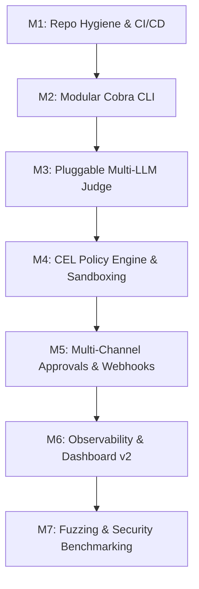

# AgentGate — Production Engineering Roadmap & Blueprint

> **Vision**: Transform AgentGate from a hackathon prototype into an enterprise-grade, high-performance **Security Firewall & Proxy for AI Agent Tool Execution (MCP)**.

---

## 1. Engineering Principles & Target Architecture

### Core Values
- **Zero AI Slop**: Clean, idiomatic, typed Go code. No hardcoded hacks or synthetic mocks mixed into production code paths.
- **Defense in Depth**: Tier 0 (static rules & CEL) + Tier 1 (pluggable LLM judge) + Tier 2 (session escalation graph) + HITL approval checkpoints.
- **Zero-Trust Tooling**: Deny-by-default, strict sandboxing (jail paths), secret redaction, and deterministic audit trails.
- **Modular & Pluggable**: Decoupled CLI, LLM providers (Anthropic, OpenAI, Gemini, Ollama), approvers, and policy engines.

```
┌─────────────────┐       JSON-RPC 2.0 (stdio/TCP)       ┌───────────────────────────────┐
│ AI Agent Client │ ───────────────────────────────────► │       AgentGate Proxy         │
│ (Claude/Cursor) │ ◄─────────────────────────────────── │                               │
└─────────────────┘                                      └──────────────┬────────────────┘
                                                                        │
                                       ┌────────────────────────────────┴────────────────────────────────┐
                                       ▼                                                                 ▼
                        ┌──────────────────────────────┐                                  ┌──────────────────────────────┐
                        │   Tier 0: Static & CEL       │                                  │     Observability Engine     │
                        │ • Deny-by-default rules      │                                  │ • JSONL Audit Trail          │
                        │ • Google CEL expressions     │                                  │ • Prometheus /metrics        │
                        │ • Path sandbox (symlink jail)│                                  │ • OpenTelemetry Tracing      │
                        │ • Token-bucket rate limiter  │                                  │ • Real-Time SSE Web UI       │
                        │ • Secret payload redactor    │                                  └──────────────────────────────┘
                        └──────────────┬───────────────┘
                                       │ (Pass)
                                       ▼
                        ┌──────────────────────────────┐
                        │   Tier 1: Multi-LLM Judge    │
                        │ • Pluggable (Claude/GPT/Ollama)
                        │ • Cascade fallback chain     │
                        │ • Session context & history  │
                        └──────────────┬───────────────┘
                                       │
                         ┌─────────────┴─────────────┐
                         ▼                           ▼
            [Score < 0.4: Allow]         [0.4 <= Score < 0.8: HITL] ──► Human Approver (CLI / Webhook / Web UI)
                         │                           │
                         │ (Approved)                │ (Denied)
                         ▼                           ▼
        ┌────────────────────────────────┐     [Score >= 0.8: Block] ──► 403 / MCP Policy Violation
        │ Child MCP Tool Server (Worker) │
        └────────────────────────────────┘
```

---

## 2. Git Workflow & Branching Strategy

All work must follow standard open-source conventions:

### Branch Naming Scheme
- `feat/<feature-name>`: New capabilities (e.g. `feat/multi-provider-judge`)
- `refactor/<target>`: Structural improvements (e.g. `refactor/cobra-cli`)
- `fix/<bug-name>`: Bug fixes and patches (e.g. `fix/symlink-traversal`)
- `docs/<topic>`: Documentation and guides (e.g. `docs/api-specs`)
- `test/<suite>`: Benchmarks, fuzzing, and test suites (e.g. `test/adversarial-benchmarks`)

### Commit Convention
```
<type>(<scope>): <short summary>

[optional body]
[optional issue reference]
```
*Examples*:
- `feat(judge): add local Ollama and vLLM provider backends`
- `refactor(cli): migrate root flags to spf13/cobra commands`
- `fix(gate): resolve symlink bypass in filepath jail validator`

---

## 3. Milestones & Step-by-Step Execution Plan



---

### 📦 Milestone 1: Repository Hygiene, Tooling & CI/CD
**Branch**: `feat/repo-hygiene`  
**Goal**: Clean all build artifacts from Git, establish strict linting, reproducible builds, and GitHub Actions CI.

- [ ] **Step 1.1**: Purge binary files and caches from Git:
  ```bash
  git rm --cached agentgate.exe agentgate.exe~ eval-harness.exe mock-tools.exe AgentGate-source-code.zip agentgate-hackathon-progress.bundle smoke-audit.jsonl
  ```
- [ ] **Step 1.2**: Update [`.gitignore`](file:///.gitignore) to permanently ignore binaries, bundles, temporary test logs, coverage files, and OS artifacts.
- [ ] **Step 1.3**: Create a root [`Makefile`](file:///Makefile) with targets:
  - `make build` (compiles all binaries into `bin/`)
  - `make test` (runs unit & e2e tests)
  - `make test-race` (`go test -race -v ./...`)
  - `make lint` (runs `golangci-lint run`)
  - `make vuln` (runs `govulncheck ./...`)
  - `make clean` (cleans `bin/` and test output)
- [ ] **Step 1.4**: Configure `.github/workflows/ci.yml`:
  - Multi-platform test matrix (Ubuntu, macOS, Windows).
  - Go version matrix (Go 1.22, Go 1.23+).
  - Linter check (`golangci-lint-action`).
  - Vulnerability scan (`govulncheck-action`).
  - Automated code coverage reporting (`Codecov`).
- [ ] **Step 1.5**: Add [`Dockerfile`](file:///Dockerfile) (multi-stage build with minimal scratch/distroless image) and [`docker-compose.yml`](file:///docker-compose.yml).

---

### 🕹️ Milestone 2: Modern CLI & Structured Configuration
**Branch**: `feat/cli-cobra`  
**Goal**: Replace rudimentary `flag` parsing with an industry-standard CLI architecture (`spf13/cobra` + `spf13/viper`).

- [ ] **Step 2.1**: Restructure `cmd/agentgate` using Cobra commands:
  - `agentgate proxy`: Proxy agent stdio to tool server with active firewall.
  - `agentgate dashboard`: Run the standalone web monitoring dashboard.
  - `agentgate eval`: Run the security benchmark & adversarial eval harness.
  - `agentgate validate`: Lint and validate `agentgate.yaml` configuration.
  - `agentgate demo`: Launch self-generating demo traffic for evaluation.
  - `agentgate version`: Print build version, commit SHA, and Go runtime info.
- [ ] **Step 2.2**: Integrate `spf13/viper` for unified config loading:
  - Supports YAML configuration (`configs/agentgate.yaml`).
  - Environment variable overrides with prefix `AGENTGATE_*` (e.g. `AGENTGATE_AUDIT_LOG`).
  - Explicit CLI flag precedence (`--config`, `--timeout`, `--audit`).
- [ ] **Step 2.3**: Adopt Go standard `log/slog`:
  - Structured JSON logs for machine consumption or colorful human-readable text logs.
  - Configurable log levels (`DEBUG`, `INFO`, `WARN`, `ERROR`).

---

### 🧠 Milestone 3: Pluggable Multi-Provider LLM Judge
**Branch**: `feat/multi-provider-judge`  
**Goal**: Decouple the Tier 1 judge from hardcoded Anthropic calls to support multiple cloud and local LLM backends with automated fallback.

- [ ] **Step 3.1**: Define a unified `Provider` interface:
  ```go
  type Provider interface {
      Name() string
      AssessRisk(ctx context.Context, req AssessmentRequest) (Verdict, error)
  }
  ```
- [ ] **Step 3.2**: Implement provider drivers:
  - `anthropic`: Claude 3.5 Sonnet / Haiku (structured tool choice).
  - `openai`: GPT-4o / GPT-4o-mini (JSON schema structured outputs).
  - `gemini`: Google Gemini 1.5 / 2.5 Flash via REST SDK.
  - `ollama` / `vllm`: Local offline models (Llama 3.1, Qwen 2.5) for air-gapped environments.
- [ ] **Step 3.3**: Implement **Fallback Cascade Judge**:
  - Primary judge (e.g. fast local Ollama or lightweight model).
  - Secondary fallback judge (e.g. Claude 3.5 Sonnet) on API error, timeout, or ambiguous risk score.
- [ ] **Step 3.4**: Make all thresholds fully dynamic via YAML:
  ```yaml
  judge:
    provider: anthropic
    model: claude-3-5-haiku-20241022
    fallback_provider: ollama
    fallback_model: llama3.1:8b
    block_threshold: 0.80
    review_threshold: 0.40
    fail_open: true
    timeout: 10s
    high_risk_tools: ["shell", "write_file", "execute_sql"]
  ```

---

### 🛡️ Milestone 4: Advanced Policy Engine (CEL & Sandboxing)
**Branch**: `feat/cel-policy-engine`  
**Goal**: Move beyond naive regex into fine-grained programmatic rules, filesystem jail roots, and network boundaries.

- [ ] **Step 4.1**: Integrate **Google CEL (Common Expression Language)**:
  - Compile and execute deterministic, fast in-memory expressions on tool arguments.
  - Example: `args.path.startsWith('/home') && args.mode == 'write'`.
- [ ] **Step 4.2**: Implement **Filesystem Jail Sandboxing**:
  - Real canonical path resolution using `filepath.EvalSymlinks` to defeat symlink bypasses (e.g. `/tmp/safe_link -> /etc/shadow`).
  - Allowed root directories validation (e.g. only allow operations inside `/workspace`).
- [ ] **Step 4.3**: Add **Network & SSRF Guardrails**:
  - Restrict URL/IP targets in HTTP tool arguments.
  - Automatically block loopback (`127.0.0.1`), link-local metadata (`169.254.169.254`), and private RFC 1918 subnets unless explicitly whitelisted.
- [ ] **Step 4.4**: Enhanced Redaction Engine:
  - Automatic detection and scrubbing of JWTs, AWS credentials (`AKIA...`), GitHub tokens (`ghp_...`), and RSA/SSH private keys.

---

### 🤝 Milestone 5: Multi-Channel Human-in-the-Loop (HITL)
**Branch**: `feat/approval-channels`  
**Goal**: Support real-world approval channels for consequential tool calls requiring operator confirmation.

- [ ] **Step 5.1**: Asynchronous Approval Token Interface:
  - Generates a cryptographically secure approval request ID with a configurable timeout.
- [ ] **Step 5.2**: Implement Approval Adapters:
  - **CLI Approver**: Interactive terminal prompt (`[y/N]`) with colored diff preview.
  - **Webhook Approver**: Sends signed POST webhook to external services (Slack bot, internal ops portal).
  - **REST API / Dashboard Approver**: Allows operators to review pending calls and click "Approve" / "Deny" directly in the web UI.
- [ ] **Step 5.3**: Audit Logging for Operator Actions:
  - Record reviewer identity, approval timestamp, and comments into `agentgate-audit.jsonl`.

---

### 📊 Milestone 6: Enterprise Observability & Dashboard v2
**Branch**: `feat/dashboard-v2`  
**Goal**: Elevate the web dashboard and export metrics to Prometheus and OpenTelemetry.

- [ ] **Step 6.1**: Prometheus Metrics:
  - Expose `/metrics` endpoint with Prometheus counters, gauges, and histograms:
    - `agentgate_requests_total{tool, decision}`
    - `agentgate_latency_seconds_bucket{tool}`
    - `agentgate_judge_risk_score_histogram`
    - `agentgate_redacted_secrets_total`
- [ ] **Step 6.2**: OpenTelemetry Tracing:
  - Trace the entire tool call lifecycle: Agent Request ➔ Rate Limit ➔ Tier 0 Check ➔ Tier 1 Judge ➔ Child Server Execution ➔ Sanitized Response.
- [ ] **Step 6.3**: Modernize Dashboard Frontend:
  - Self-contained, responsive design with dark mode, live latency graphs, filterable JSONL activity feed, and tool breakdown charts.

---

### 🧪 Milestone 7: Adversarial Benchmarks, Fuzzing & Security Hardening
**Branch**: `feat/eval-benchmark-suite`  
**Goal**: Provide a rigorous, repeatable security evaluation harness suitable for academic and enterprise audits.

- [ ] **Step 7.1**: Expand Adversarial Benchmark Suite:
  - Increase dataset from 20 to 100+ realistic attack vectors across 8 attack categories:
    - Obfuscated shell payloads (base64, hex encoding, Python one-liners).
    - Privilege escalation & persistence (cron, systemd, ssh keys).
    - Exfiltration & C2 beaconing (DNS tunneling, curl webhook exfiltration).
    - Multi-turn escalation attacks across session history.
- [ ] **Step 7.2**: Fuzz Testing (`go test -fuzz`):
  - Fuzz JSON-RPC parser with malformed packets, oversized payloads, and recursion bombs.
  - Fuzz policy compiler and redaction regex engines against ReDoS (Regular Expression Denial of Service).
- [ ] **Step 7.3**: Automated Benchmark CI Check:
  - Measure accuracy, false-positive rate, and missed danger rate in CI on every PR.

---

## 4. Quick Command Reference for Daily Development

```bash
# 1. Start on a new feature branch
git checkout -b feat/repo-hygiene

# 2. Run all tests with race detector
go test -race -v ./...

# 3. Lint the codebase
golangci-lint run

# 4. Check for known Go vulnerabilities
govulncheck ./...

# 5. Run the evaluation benchmark
go run ./cmd/eval-harness -config configs/agentgate.yaml -cases eval/cases.json

# 6. Run live proxy with dashboard
go run ./cmd/agentgate -config configs/agentgate.yaml -serve :8700
```
